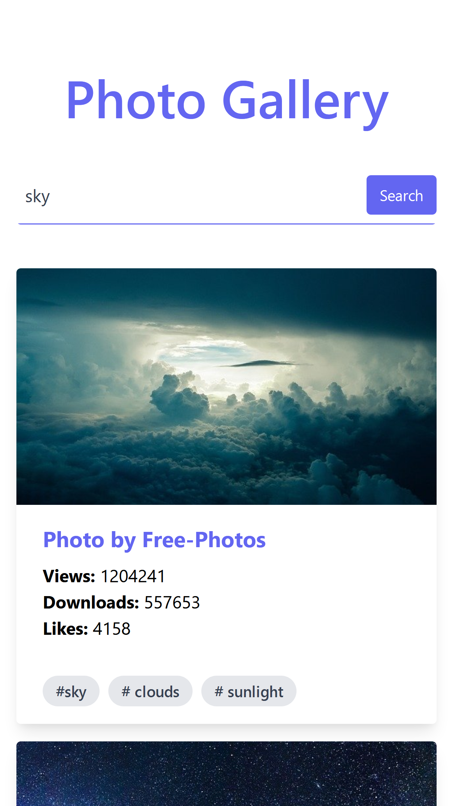
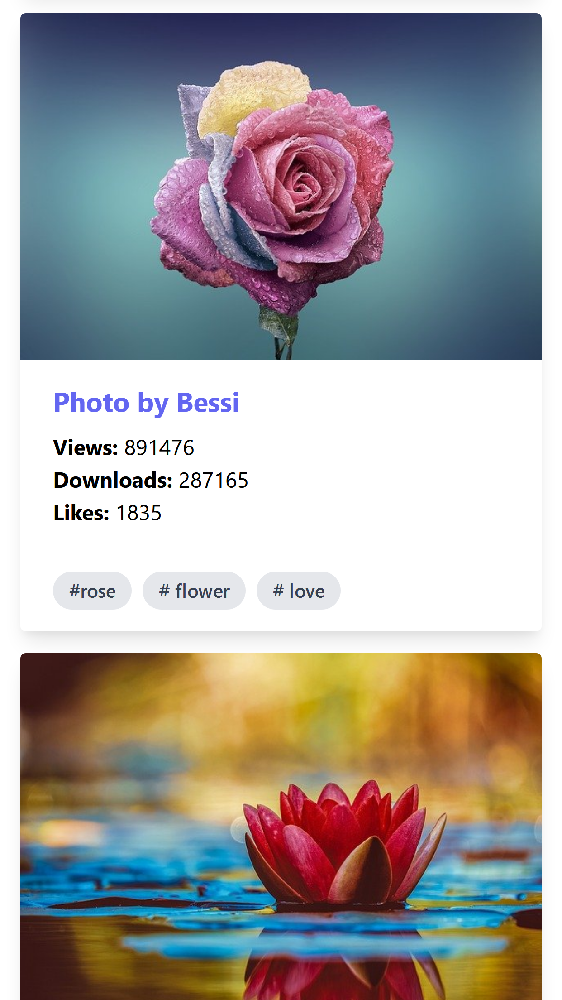

# Image Gallery - ReactJS & Tailwaind CSS 🖼️

```sh 
Current project status: Completed. ✅  
```

This is an exercise react application to search for images using the Pixabay API:
  - Tailwind CSS & PostCSS
  - ReactJS

# ~ Code Example: 👨🏿‍💻 

As an example of the project, Fetch API (a simple interface for fetching resources) was used to retrieve data from the Pixabay API:

```sh
useEffect(() => {
  // fetching data from the API
  fetch(
    `https://pixabay.com/api/?key=${process.env.REACT_APP_PIXABAY_API_KEY}&q=${term}&image_type=photo&pretty=true`
  )
    // transforming to json
    .then((res) => res.json())
    // retrieving the results
    .then((data) => {
      setImages(data.hits);
      setIsLoading(false);
    })
    // Catching errors
    .catch((err) => console.log(err));
},
// method will run when this state/dependency is updated
[term]
);
```

After mapping this data to the `images` state array and passing it as props to the ImageCard component, a limited amount of images was rendered dynamically to the main App component.

# ~ Project Previews: 🖼️ 

[

```sh 
iPhone 6/7/8 Plus iOS 11 Screen View: 
```
Search |  Images |
|:-----------:|:-----------:|
 |  |